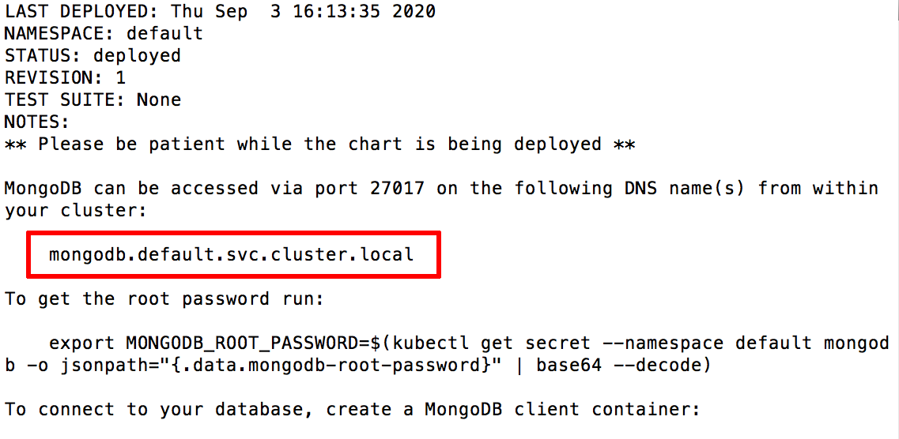
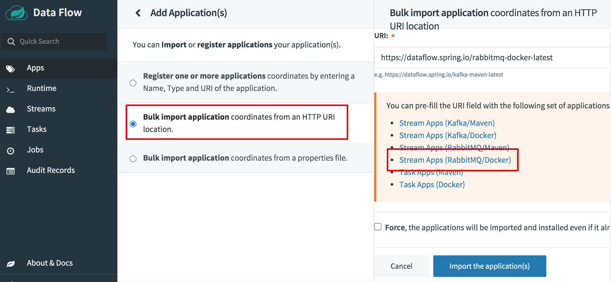
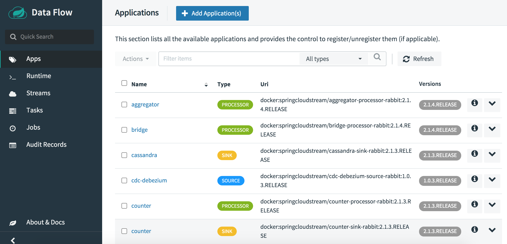
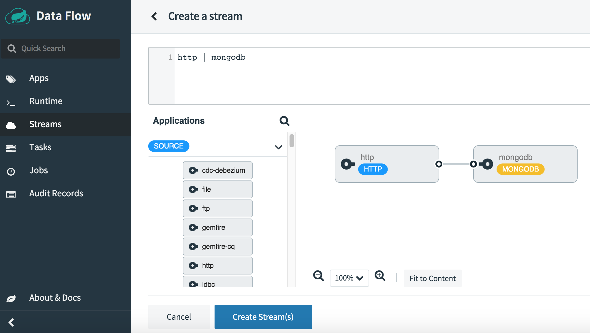
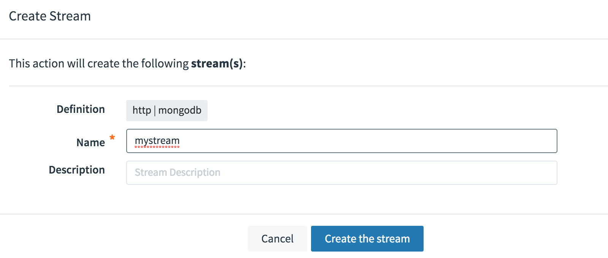
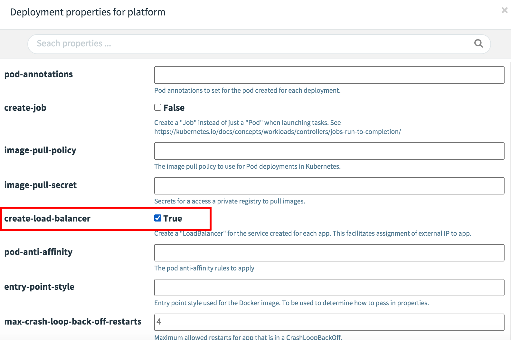
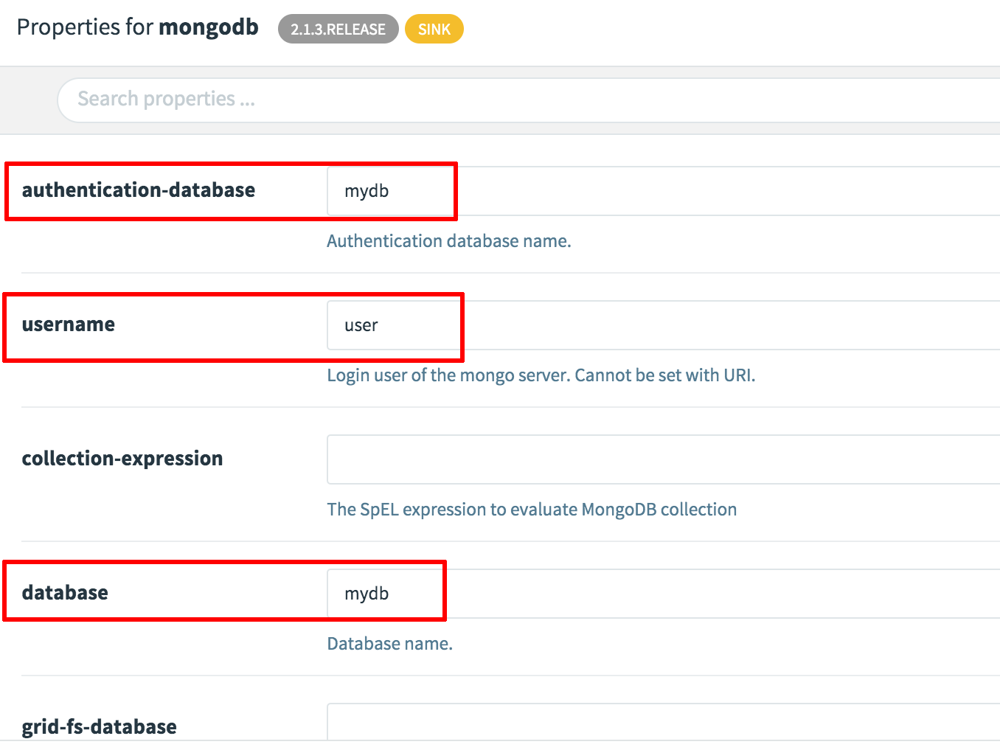

[Spring Cloud Data Flow](https://dataflow.spring.io/) is a framework for creating data streaming applications and batch data processing pipelines. It is commonly used to develop and test microservices, and it comes with built-in support for popular data sources and data storage services. It is available under an Apache license.

For developers looking to quickly build data processing applications on Kubernetes using Spring, the easiest way is with [Bitnami's Spring Cloud Data Flow Helm chart](https://github.com/bitnami/charts/tree/master/bitnami/spring-cloud-dataflow). This chart bootstraps a Spring Cloud Data Flow deployment on a Kubernetes cluster using the Helm package manager. It is also secure, updated and packaged in accordance with current best practices.

This article walks you through the process of deploying Spring Cloud Data Flow on Kubernetes using the Bitnami Spring Cloud Data Flow Helm chart. It also shows you how to connect your deployment with a MongoDB database service (also running on Kubernetes) and create a simple Spring Cloud Data Flow stream that accepts data input over HTTP and saves the data to the MongoDB service.

## Assumptions and Prerequisites

This article assumes that you have a Kubernetes cluster running with Helm v3.x and *kubectl* installed. [Learn more about getting started with Kubernetes and Helm using different cloud providers](https://docs.bitnami.com/kubernetes/).

## Step 1: Deploy MongoDB on Kubernetes

> If you already have a MongoDB deployment, you can use that instead and skip to [Step 2](#step-2-deploy-spring-cloud-data-flow-on-kubernetes).

The first step is to deploy a MongoDB service on Kubernetes. The simplest way to do this is with [Bitnami's MongoDB Helm chart](https://github.com/helm/charts/tree/master/stable/mongodb). Follow the steps below:

* Add the Bitnami chart repository to Helm:

  ```bash
  helm repo add bitnami https://charts.bitnami.com/bitnami
  ```

* Execute the following command to deploy MongoDB. The command below will also create a new database named *mydb* and a user account named *user* with full privileges on that database. Remember to replace the MONGODB-ROOT-PASSWORD placeholder with a custom password for the MongoDB administrator account and the MONGODB-USER-PASSWORD placeholder with a custom password for the *user* account.

  ```bash
  helm install mongodb bitnami/mongodb \
    --set auth.rootPassword=MONGODB-ROOT-PASSWORD \
    --set auth.database=mydb \
    --set auth.username=user \
    --set auth.password=MONGODB-USER-PASSWORD
  ```

  Wait for a few minutes until the chart is deployed. Note the DNS name for the service in the cluster. In this example, it will be *mongodb.default.svc.cluster.local*.

  

  > See the [complete list of parameters supported by the Bitnami MongoDB Helm chart](https://github.com/bitnami/charts/tree/master/bitnami/mongodb#parameters).

## Step 2: Deploy Spring Cloud Data Flow on Kubernetes

The next step is to deploy Spring Cloud Data Flow on the same cluster using Bitnami's Helm chart and configure it for use. Follow the steps below:

* Execute the following command to deploy the chart:

  ```bash
  helm install spring bitnami/spring-cloud-dataflow
  ```

  Wait for a few minutes until the chart is deployed.

  > See the [complete list of parameters supported by the Bitnami Spring Cloud Data Flow Helm chart](https://github.com/bitnami/charts/tree/master/bitnami/spring-cloud-dataflow#parameters).

* Forward the Spring Cloud Data Flow server port:

  ```
  export SERVICE_PORT=$(kubectl get --namespace default -o jsonpath="{.spec.ports[0].port}" services spring-spring-cloud-dataflow-server)
  kubectl port-forward --namespace default svc/spring-spring-cloud-dataflow-server ${SERVICE_PORT}:${SERVICE_PORT} --address=0.0.0.0 &
  ```

* Browse to http://IP-ADDRESS:8080/dashboard, where IP-ADDRESS should be the IP address of the *kubectl* host. You will see the Spring Cloud Data Flow dashboard.
* On the "Applications" page, click the "Add Application(s)" button.
* Select the option to "Bulk import application coordinates from an HTTP URI location".
* Select the "Stream Apps (RabbitMQ/Docker)" category. The import URL will be prefilled for you.
* Click "Import the application(s)" to start the import process.

  

* Navigate back to the "Applications" page. Confirm that you see the imported applications, as shown below.

  

## Step 3: Create a Spring Cloud Data Flow stream

The next step is to create a stream that accepts input over HTTP and then streams that data to MongoDB using Spring Cloud Data Flow. Follow these steps:

* Navigate to the "Streams" page.
* Click the "Create stream(s)" button.
* In the "Stream definition" box, define an HTTP (source) to MongoDB (sink) stream by entering the values below:

  ```
  http | mongodb
  ```

* Click the "Create stream(s)" button to proceed.

  

* Enter a name for the stream when prompted. Click the "Create the stream" button to save the new stream. In this example, the stream is named *mystream*.

  

* Navigate back to the "Streams" page. Confirm that you see the new stream in the list of streams.
* Click the "Deploy" button to deploy the new stream.

  

* In the "Deploy Stream Definition" page, configure the deployment parameters for the stream as follows:

  * In the *http* source column, find the "Deployment Platform" section and set the *create-load-balancer* property to true. This makes the HTTP input endpoint for the stream available at a public IP address. Click "Update" once done.

  

  * In the *mongodb* sink column, find the "Application Properties" section and set the following properties, which should match those configured in [Step 1](#step-1-deploy-mongodb-on-kubernetes). Replace the MONGODB-USER-PASSWORD placeholder with the password defined for the *user* account in [Step 1](#step-1-deploy-mongodb-on-kubernetes). Click "Update" once done.
    * *username*: *user*
    * *authentication-database*: *mydb*
    * *database*: *mydb*
    * *password*: MONGODB-USER-PASSWORD
    * *collection*: *spring*
    * *host*: *mongodb.default.svc.cluster.local*

  

* Click the "Deploy stream" button to deploy the stream.

Wait for a few minutes until the chart is deployed. Once deployed, the "Streams" page will reflect the running deployment.


You can also check the status of the deployment using the *kubectl get pods* command.

## Step 4: Test the integration

Once the stream is deployed, you can proceed to test it, by sending it input over HTTP and then checking the MongoDB database to verify if the input was correctly saved. Follow these steps:

* Obtain the load balancer IP address for the HTTP input endpoint:

  ```bash
  kubectl get svc | grep mystream
  ```

* Send a JSON-formatted HTTP request to the endpoint. Replace the STREAM-IP-ADDRESS placeholder in the command below with the load balancer IP address.

  ```bash
  curl http://STREAM-IP-ADDRESS:8080 -X POST -H "Content-type: application/json" -d "{\"label\": \"eggs\"}"
  ```

* Connect to the MongoDB database service and query the *mydb* database and *spring* collection. Replace the MONGODB-USER-PASSWORD placeholder with the password defined for the *user* account in [Step 1](#step-1-deploy-mongodb-on-kubernetes).

  ```bash
  kubectl run --namespace default mongodb-client --rm --tty -i --restart='Never' --image docker.io/bitnami/mongodb:4.2.8-debian-10-r39 --command -- bash
  mongo admin --host "mongodb" --authenticationDatabase mydb -u user -p MONGODB-USER-PASSWORD
  use mydb
  db.spring.find()
  ```

Here is an example of the output you should see:


This confirms that the integration is working successfully and that data sent to the Spring Cloud Data Flow endpoint is being successfully streamed and saved to the MongoDB database service.

## Useful links

To learn more about the topics discussed in this guide, use the links below:

* [Bitnami Spring Cloud Data Flow Helm chart](https://github.com/bitnami/charts/tree/master/bitnami/spring-cloud-dataflow)
* [Bitnami MongoDB Helm chart](https://github.com/helm/charts/tree/master/stable/mongodb)
* [Spring Cloud Data Flow documentation](https://dataflow.spring.io/docs/)
* [Spring Cloud Stream guide](/guides/event-streaming/scs-what-is/)