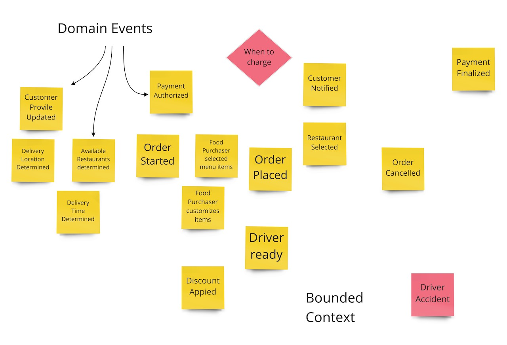
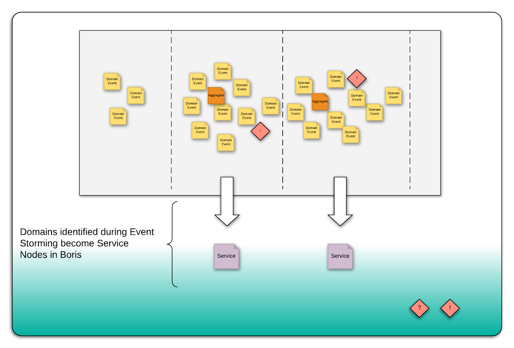

## How to Use this Method
### Sample Agenda & Prompts
1. Explain the goal of Event Storming to the group. Project the image below if necessary. Identify a legend to include a description for events, bounded contexts, services, and pain points. Draw out a legend for all the stickies and explain basic Domain Driven Design (DDD) terms.

   

1. Define “domain event” for the group:

   {}
   Example: "A 'Domain Event' represents a state transition in the domain. It’s expressed as a verb in the past tense, such as 'Order Placed' or 'Refund Initiated'.”
   {}

1. Have the group "storm the business" process by writing a series of domain events on orange sticky notes, one per note.
   - Identify the beginning and end of the event storming session in order to create a sequence of events
   - Think about an event in the past tense
   - Focus on the happy path to begin with
   - Turn sticky notes sideways 45 degrees to indicate there are questions or a need for clarification
   
   

1. Place the domain events on the wall in time order from left to right

1. As you go through the storming session, you will uncover different aspects of the existing business process. Capture them as follows:

   - Mark **trouble spots** with red sticky notes
   - Highlight **external systems** with a new color sticky note and place them near the actions/events they trigger
   - Represent **parallel processing** using vertical space
   - Highlight anything caused by a **set time period** (like batch processes or cron jobs) in a new color sticky note and place them next to triggers they control
   
   

1. After all the events are posted, pair with the domain experts to post a locally ordered sequence of events and enforce a timeline. Crowdsource feedback as you go.

   {}
   Tip: Enforcing a timeline triggers long awaited conversations and eventually STRUCTURE will emerge.
   {}

   Crowdsourced feedback may uncover missing elements. Add more stickies as needed.

1. With the timeline enforced, look for bounded contexts (aka "domain aggregates"). Find groupings of events to see what they are acting on and transferring to the next part. Identify pivotal events that indicate a transition across subdomains.

   Usually you'll see a big group followed by fewer stickies then a larger group of stickies to indicate the transfer to a new bounded context. Look for vertical swim lanes of events that may indicate bounded contexts or business capabilities.

   {}
   Tip: Draw boundaries and lines with arrows to show flow on the modeling surface. Use solid lines for bounded contexts. Draw lines with arrowheads to show direction of domain events flowing between bounded contexts.
   {}

   If you want to start bounding models with less permanence use stickies to mark general areas and withhold drawing boundaries with permanent markers until your confidence justifies it.

   You can also crowd-source identification of the nouns present on the event-storming board and place them to the side. Clumping these nouns together into related trees of data can help you form your aggregates.

1. These event clumps or common groupings give us our notional service candidates (actors or aggregates depending on how rigid the team is with DDD definitions)  These will be used during the [Boris](/practices/boris) exercise.

1. **Optional:** Identify the various views  that your users will need to carry out their actions, and important roles for various users. Use bright yellow stickies to identify user roles or [personas](/practices/personas). Enrich the event storming with incremental notations using stickies for user roles, personas, money, or whatever is important in the domain.

1. At the conclusion, be sure to take a lot of pictures so you can capture the output for later use

#### Success/Expected Outcomes
You know you’ve finished when you have:
- Identified bounded contexts and aligned domains
- Mapped each bounded context with a business subdomain (it’s typically 1:1)
- Manifested each bounded context/subdomain as a service in the target architecture

#### Facilitator Notes & Tips

**Event Storming is a group exercise to scientifically explore the domains and problem areas of a monolithic application.** The most concise description of the process of event storming comes from [Vaughn Vernon's _Domain-Driven Design Distilled_](https://www.oreilly.com/library/view/domain-driven-design-distilled/9780134434964/) book and the color around the process inspired from [Alberto Brandolini's book _Event Storming_](https://www.eventstorming.com/book/) has been improved on by VMware.

**Event Storming is a technique used to visualize complex systems and processes.** This could range from monoliths to value streams. Event Storming -- inspired from [gamestorming](https://gamestorming.com/) -- is a technique for harnessing and capturing the information captured in a group’s minds. It surfaces conflicts and different perspectives of a complex system and bubbles up the top constraints and problem spots. As an event storming facilitator you have one job - create a safe environment for the exchange and output of ideas and data. The job is 50% technical facilitation and 50% soft people facilitation where you are reading body language. **A single facilitator can typically orchestrate groups of 15-20.** For a group of 30 or more you need two facilitators.

**Event Storming is usually conducted in two phases.** A high level event storm to identify the domains and then a subsequent ES into a top constraint - the core domain.

**The implementation of Event Storming is stickies.** In its simplest form Event Storming is basically a facilitated group story telling. The stickies represent domain events -  or things that happened in the past. The trouble spots are identified by red stickies. The color of the stickies does not matter. What does matter is that you start simple and then add the notation incrementally. Start simple and then add the information in layers. Event Storming can serve many goals - break down a monolith into constituent bounded contexts, create a value stream - as a way to onboard employees, etc.

**There is no ONE correct style of Event Storming.** Every session is different from another based on the desired goals and outcomes. So don’t worry about getting it right- just do it and roll your own style. Multiple iterations of this activity may be needed a varying levels of abstraction to realize the outcomes needed

**An Event Storming is only successful if the right people are involved.** This is a mix of business domain experts, customer executives, stakeholders, business analysts, software developers, architects, testers, and folks who support the product in production. Subject matter experts, product owners and developers that knows and understands the application domain. This process enables cross perspective conversation throughout the team as well as a standard definition of the terms used by both technical and non-technical team members.

**Running a Cinderella exercise prior to Event Storming can be a great ice-breaker!** This exercise maps out the story of Cinderella. The PM will choose a start and end point and ask participants to scribe events that happened in the movie. Afterwards, storytelling will confirm everyone's recollection of the movie. This exercise provides the team with a safe environment to learn about Event Storming without getting into the actual exercise.

## Related Practices

Event Storming is an activity within the [Swift Method](/practices/swift-method).

### Preceding

None at the moment

### Following

[Boris](/practices/boris)

## Real World Examples

<a href="https://www.youtube.com/watch?v=by8SdfF56vI" target="_blank">Deconstructing Monoliths With Domain Driven Design</a>  
<a href="https://miro.com/app/board/o9J_kzaSk0E=/" target="_blank">WeBeFoods Example Mock (via Miro)</a>  

## Recommended Reading

Motivation for the Event Storming exercise:  
<a href="https://www.amazon.com/Gamestorming-Playbook-Innovators-Rulebreakers-Changemakers/dp/0596804172" target="_blank">Gamestorming: A Playbook for Innovators, Rulebreakers, and Changemakers</a> by Dave Gray, Sunni Brown, and James Macanufo

Children’s book-style big picture presentation on Event Storming:  
<a href="https://speakerdeck.com/rkelapure/event-storming" target="_blank">Event Storming: Games Are Not Just for Kids</a>

<a href="https://leanpub.com/introducing_eventstorming" target="_blank">Event Storming</a> by Alberto Brandolini (with related info at <a href="https://www.eventstorming.com/" target="_blank">EventStorming.com</a>)

Domain Driven Design (DDD) - provides the theoretical underpinnings of decomposing monoliths. <a href="https://www.amazon.com/Domain-Driven-Design-Distilled-Vaughn-Vernon/dp/0134434420" target="_blank">Domain-Driven Design Distilled</a> by Vaughn Vernon is the perfect book to understand the science of DDD and how ES fits into the grander scheme of things - how do the ES artifacts translate into software design, architecture and an actual backlog.