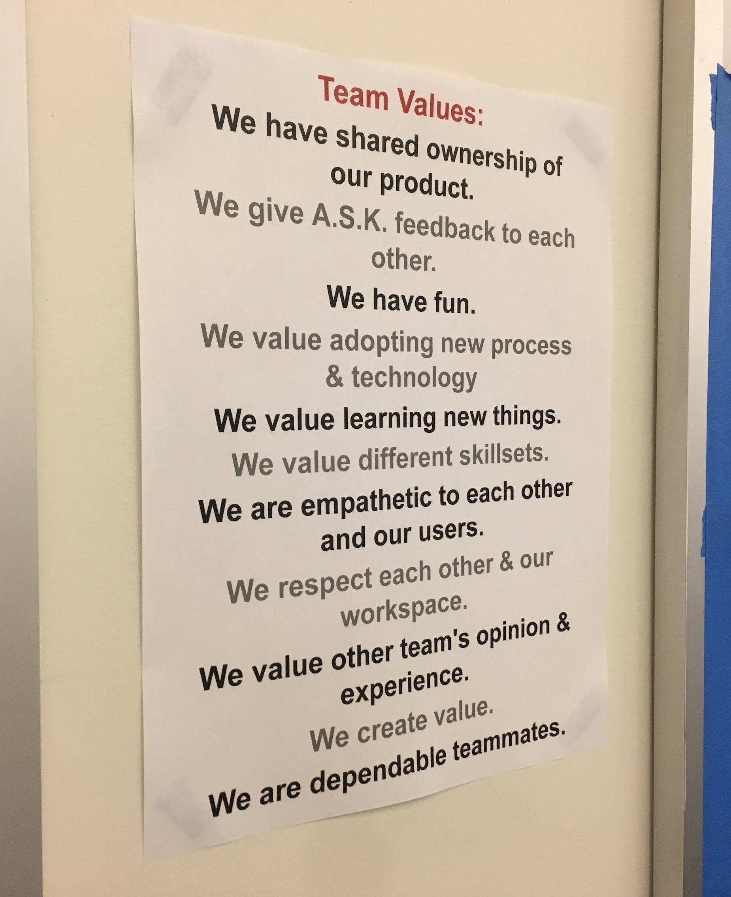

## How to Use this Method
### Sample Agenda & Prompts
1. Write the following prompts on the whiteboard:
        
   - *"We believe..."*
   - *"We value..."*
   - *"We respect..."*
   - *"We ____________..."*

1. Set a timer for 6 minutes and have the team silently generate value statements using the prompts on the board. Each value statement should be on its own sticky note.

   {}
   Tip: You can play some light background music (ideally instrumental) to help relax the atmosphere during generation
   {}

1. Go around the room individually and ask each team member to share a value statement and their thinking behind it (especially if it’s not obvious). Collect any similar value statements from other team members and place the groups/themes in rows on the whiteboard

   

1. Repeat until all sticky notes have been shared and are grouped on the whiteboard

1. Thank the team for the great content and explain that they will be typed up and summarized. Take a picture of the output.

1. Post-Workshop Actions

   - Type up the sticky notes written by the team, keeping them grouped. Be sure this document is in the team’s shared drive/folder
   - Summarize each group with one value statement. This might be an umbrella sentence that describes the group or one of the value statements in that group.
   - Take the list of summarized value statements and compile them into a single document. Print it out and hang it up in the team area.

#### Success/Expected Outcomes
You know you’re done when you’ve created a set of agreed on team values that can be put up in the team area and referred to during the project and/or consulting engagement.

#### Facilitator Notes & Tips

Every member of the “core” team should be involved in this activity. A helpful way to think about the “core” team is it’s the folks who will be working full time together, ideally co-located, for the lifecycle of the project and/or consulting engagement.

These team values can be leveraged again at the end of the project and/or consulting engagement if you decide to do a How We Work transition activity. This will allow the team to adjust their values and identify aligned practices they’ve done during the engagement to keep doing after they return home.

## Related Practices

Coming soon: How We Work

## Real World Examples

## Recommended Reading

None at the moment